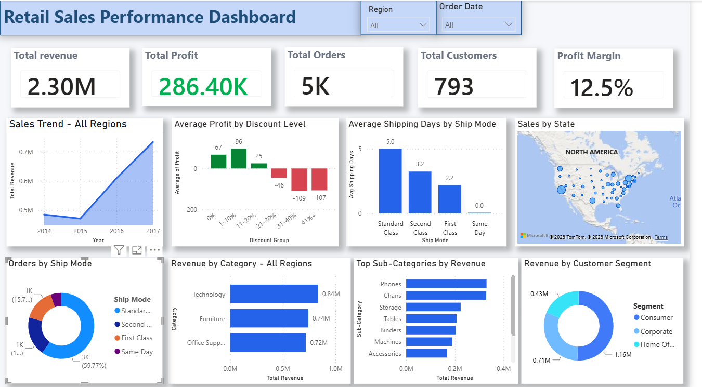
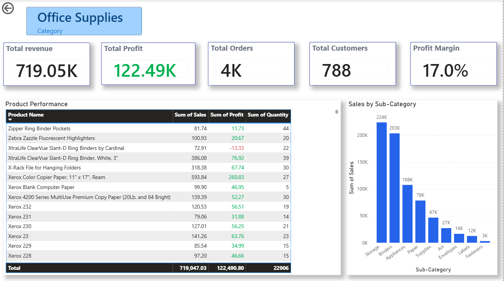

# 📊 Retail Sales Performance Dashboard

An interactive Power BI dashboard developed to analyze retail sales performance across products, customers, regions, discounts, and shipping methods.

The project transforms the Sample Superstore dataset into an interactive business intelligence dashboard designed to identify sales trends, profitability patterns, customer behavior, and operational performance.

## 🎯 Project Objectives

The main objectives of this project were to:

- Monitor overall sales and profitability performance
- Analyze sales trends over time
- Understand the relationship between discount levels and profitability
- Compare product categories and sub-categories
- Analyze customer segments
- Examine geographic sales performance
- Evaluate shipping method usage and average shipping time
- Enable interactive exploration using filters, tooltips, and drill-through functionality

## 📁 Dataset

This project uses the **Sample Superstore** retail dataset.

The dataset contains order-level information including:

- Order and shipping dates
- Customer and segment information
- Geographic information
- Product categories and sub-categories
- Sales and quantity
- Discounts
- Profit
- Shipping modes

The dataset included in the `data` folder is the **original, unprocessed dataset** used for this project.

Data preparation and transformations required for the analysis were performed within Power BI before building the dashboard.

## 🛠️ Tools & Technologies

- **Power BI Desktop** — dashboard development and data visualization
- **Power Query** — data preparation and transformation
- **DAX (Data Analysis Expressions)** — calculated columns and measures
- **GitHub** — project documentation and version hosting

## 📈 Key Performance Indicators

The dashboard provides five primary KPIs:

- **Total Revenue:** $2.30M
- **Total Profit:** $286.40K
- **Total Orders:** approximately 5K
- **Total Customers:** 793
- **Profit Margin:** 12.5%

## 📊 Dashboard Analysis

The main dashboard includes analysis of:

- Sales trends over time
- Average profit across different discount levels
- Average shipping days by shipping mode
- Geographic sales distribution by state
- Orders by shipping mode
- Revenue by product category
- Top sub-categories by revenue
- Revenue distribution across customer segments

Users can dynamically filter the dashboard using **Region** and **Order Date** slicers.

## 🔍 Discount & Profitability Analysis

Discount levels were grouped into meaningful ranges to better understand their relationship with profitability.

The analysis shows that lower discount ranges maintain positive average profit, while higher discount levels are associated with negative average profit.

This highlights discount strategy as an important area for profitability management.

## 🚚 Shipping Analysis

A calculated **Shipping Days** field was created using the difference between Order Date and Ship Date.

Shipping performance was then compared across shipping modes using average shipping time.

The analysis shows clear differences in delivery time between Same Day, First Class, Second Class, and Standard Class shipping.

## 🧭 Interactive Features

The dashboard includes several interactive Power BI features:

- Region filtering
- Year, quarter, and month date filtering
- Cross-filtering between visuals
- Interactive geographic map
- Custom report-page tooltip for state-level information
- Category drill-through analysis
- Dynamic chart titles based on filter context
- Conditional formatting for profitability

## 🔎 Category Drill-Through

Users can drill through from a product category on the main dashboard to a dedicated **Category Details** page.

The page provides:

- Category-specific revenue
- Profit
- Orders
- Customers
- Profit margin
- Product-level performance
- Sales by sub-category

## 💡 Key Business Insights

### Overall Performance
The business generated approximately **$2.30M in sales** and **$286K in profit**, resulting in an overall profit margin of approximately **12.5%**.

### Sales Trend
Sales strengthened considerably during the later years of the dataset, with 2017 showing the strongest overall sales performance.

### Discount Impact
Higher discount levels are associated with lower profitability. Average profit becomes negative across several higher discount ranges, suggesting that aggressive discounting should be monitored carefully.

### Product Performance
Technology generates the highest revenue among the three major product categories, followed by Furniture and Office Supplies.

### Customer Segments
The Consumer segment contributes the largest share of overall revenue, followed by Corporate and Home Office customers.

### Shipping Performance
Standard Class is the most frequently used shipping method while also having the longest average shipping time among the available shipping modes.

### Geographic Performance
Sales vary considerably across states, allowing high- and low-performing geographic markets to be explored through the interactive map and custom tooltip.

## 💼 Business Recommendations

Based on the dashboard analysis:

- Review high-discount transactions and evaluate whether aggressive discounting is negatively affecting profitability.
- Continue monitoring Technology products because of their strong contribution to overall revenue.
- Maintain focus on the Consumer segment while exploring growth opportunities within Corporate and Home Office segments.
- Monitor shipping performance alongside shipping method usage to identify potential operational improvements.
- Use state-level performance analysis to identify geographic opportunities and underperforming markets.

## 📂 Repository Structure

    retail-sales-powerbi-dashboard/
    │
    ├── README.md
    ├── Retail_Sales_Performance_Dashboard.pbix
    │
    ├── data/
    │   └── [original dataset]
    │
    └── images/
        ├── main-dashboard.png
        └── category-details.png

## 🎓 What I Learned

Through this project, I gained practical experience in:

- Preparing retail data for analysis in Power BI
- Creating DAX measures and calculated columns
- Designing KPI driven dashboards
- Selecting appropriate visualizations for different business questions
- Creating interactive slicers and cross-filtering
- Building report page tooltips
- Implementing drill through navigation
- Applying conditional formatting
- Analyzing business performance and translating visual findings into actionable insights
- Designing and refining a dashboard for clear business communication

## 📌 Project Status

**Completed**

The dashboard has been tested for slicer interactions, cross-filtering, drill-through navigation, report-page tooltips, and dynamic filtering.
